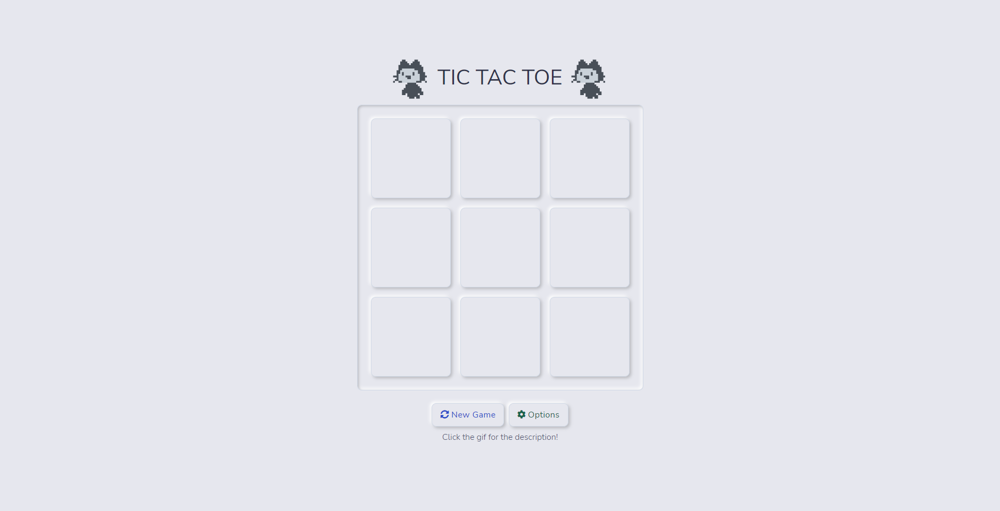
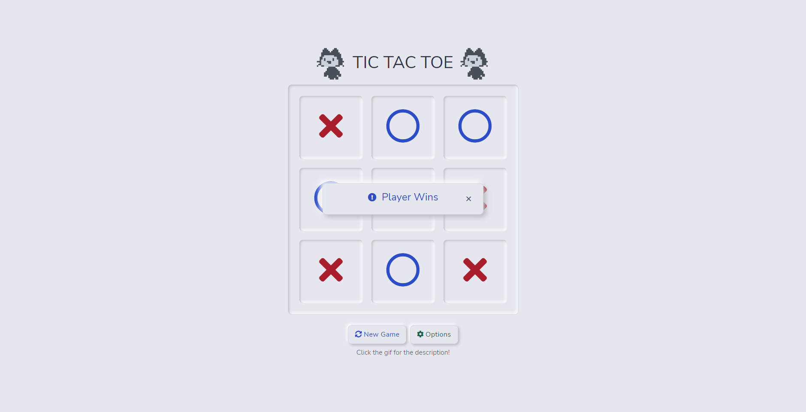
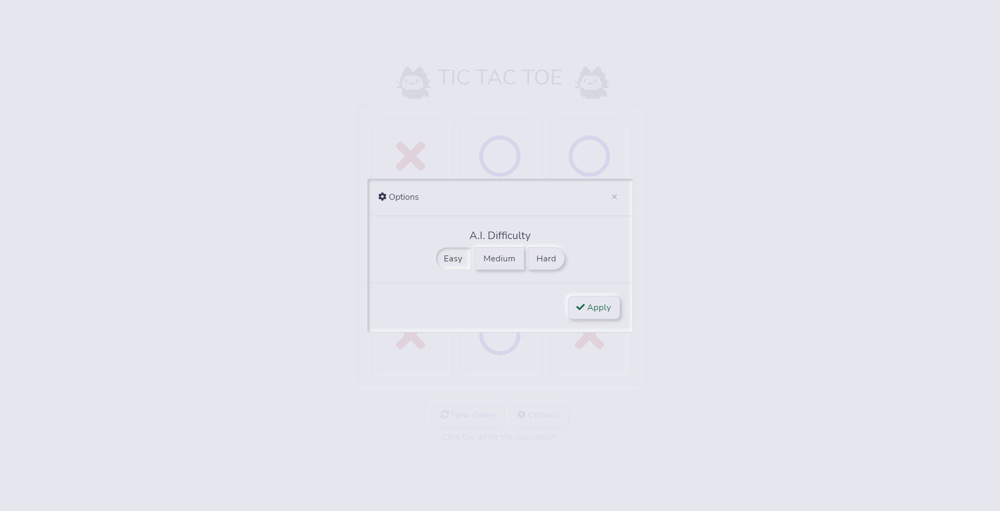

# TicTacToe

This TicTacToe web application utilizes the Negamax Algorithm from the [easyAI](https://github.com/Zulko/easyAI) Python Library.

## Installation

- You must have `Python >= 3.9.8` before trying to install.\
- Clone the repository using `git clone https://github.com/miyufi/TicTacToe.git `\
- Use the package manager [pip](https://pip.pypa.io/en/stable/) to install all the requirements from requirements.txt.

```bash
$ pip install -r requirements.txt
```

## Usage

```bash
$ flask run
```

or

```bash
$ python app.py
```

## Preview




